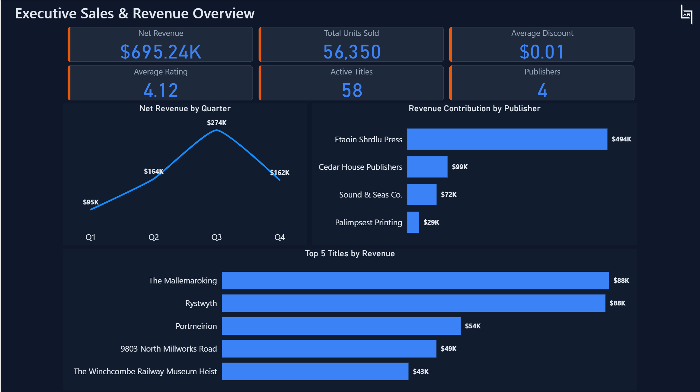
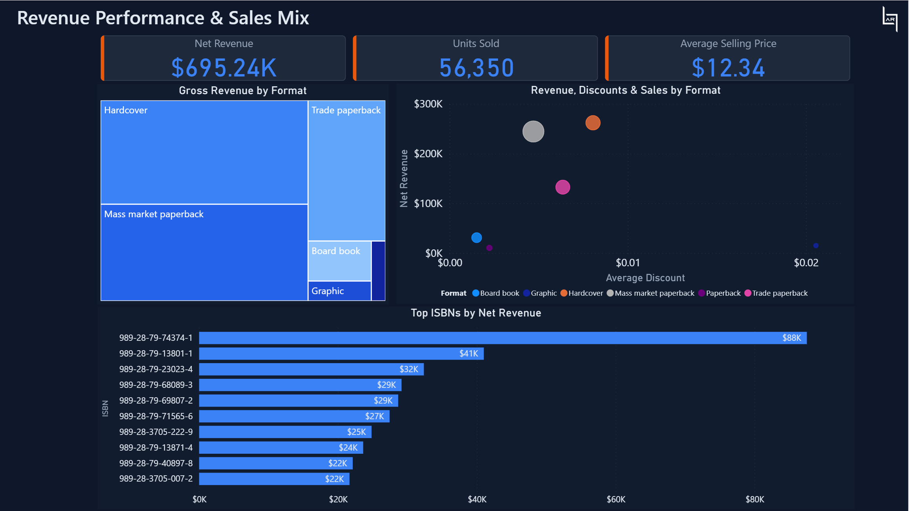
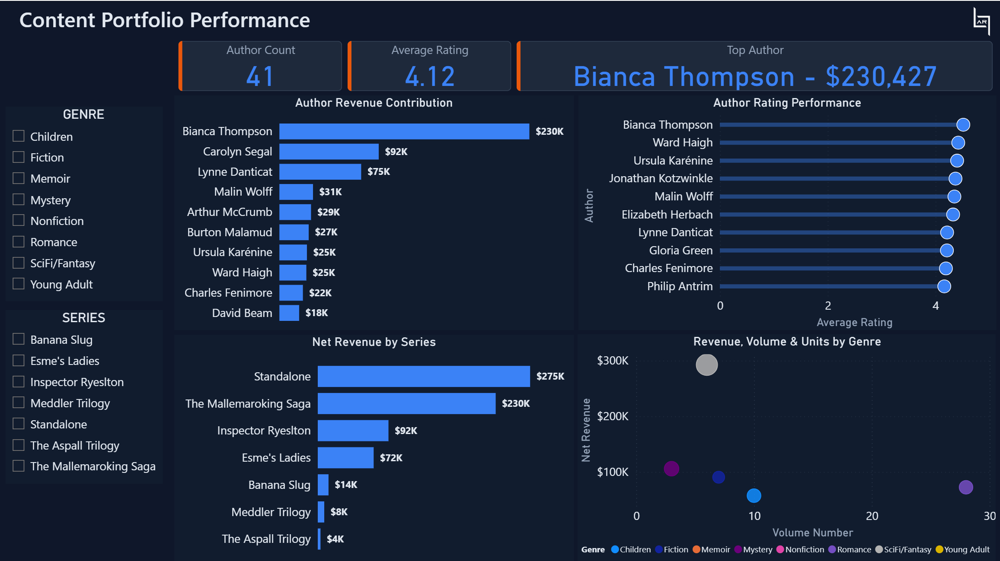
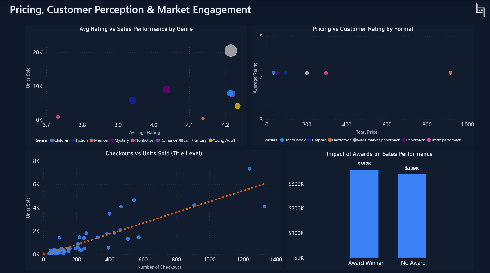

# 📚 Publishing Industry Sales & Performance Dashboard

> A multi-page Power BI dashboard delivering end-to-end visibility into a bookshop's sales performance, content portfolio, author analytics, and customer market engagement — built to surface actionable insights for publishing business decisions.

---

## 🔍 Overview

This project presents a **Power BI dashboard** built on a structured bookshop dataset, designed to answer critical business questions across revenue, inventory, authorship, and market positioning.

**Problem it solves:** Independent bookshops and small publishers often lack a unified view of their commercial and content performance. This dashboard bridges that gap by transforming raw transactional data into clear, interactive visualizations — without requiring SQL or data engineering skills to explore.

---

## ✨ Key Features

- **Executive KPI Snapshot** — Net revenue, units sold, average discount, ratings, active titles, and publisher count at a glance
- **Quarterly Revenue Trends** — Line chart tracking revenue momentum across Q1–Q4
- **Publisher Contribution Analysis** — Ranked bar chart comparing revenue share across all 4 publishers
- **Top-Performing Titles & ISBNs** — Identify the highest-grossing books by title name and by ISBN
- **Sales Mix by Format** — Treemap and bubble chart breaking down Hardcover, Trade Paperback, Mass Market Paperback, Board Book, Graphic, and Paperback formats
- **Discount & Pricing Intelligence** — Scatter analysis of average discounts vs. net revenue by format
- **Author Revenue Rankings** — Bar chart of top-earning authors with revenue contribution
- **Author Rating Performance** — Side-by-side view of rating scores for top authors
- **Genre & Series Insights** — Bubble chart mapping genre by volume, revenue, and unit count; series-level revenue breakdown
- **Award Impact Analysis** — Bar comparison of revenue from award-winning vs. non-award titles
- **Library Checkout Correlation** — Scatter plot examining the relationship between checkouts and units sold
- **Interactive Filters** — Slicers for Genre and Series enable audience-specific deep dives

---

## 📊 Dashboard Pages

### 1. Executive Sales & Revenue Overview
The entry point for stakeholders and leadership. Displays the six core KPIs (Net Revenue: **$695.24K**, Units Sold: **56,350**, Average Discount: **$0.01**, Average Rating: **4.12**, Active Titles: **58**, Publishers: **4**) alongside quarterly revenue trends, publisher revenue contribution, and the top 5 titles by revenue. This page answers: *"How is the business performing overall?"*

### 2. Revenue Performance & Sales Mix
A deeper commercial breakdown. The treemap visualises gross revenue by format, while the scatter chart cross-references format-level net revenue against average discount and bubble size (units sold). The bottom section ranks top ISBNs by net revenue, enabling format and SKU-level decisions. This page answers: *"Which formats and editions are driving value?"*

### 3. Content Portfolio Performance
Focused on the creative and editorial side of the business. Shows author revenue contribution, author rating performance, series-level revenue, and a genre bubble chart (revenue vs. volume number). Includes Genre and Series slicers for filtered exploration. This page answers: *"Which authors, series, and genres are performing — commercially and critically?"*

### 4. Pricing, Customer Perception & Market Engagement
Bridges internal data with market signals. Four charts examine: average rating vs. units sold by genre; pricing vs. customer rating by format; library checkout volume vs. units sold at the title level; and the revenue impact of award-winning titles. This page answers: *"How do quality signals, pricing, and external recognition translate into sales?"*

---

## 💡 Key Insights

1. **Q3 is the revenue peak** — Net revenue surged to $274K in Q3 before declining to $162K in Q4, suggesting a seasonal reading pattern or campaign-driven spike worth replicating.

2. **Etaoin Shrdlu Press dominates publisher revenue** — With $494K of the $695K total, this single publisher accounts for ~71% of all revenue, indicating heavy supplier concentration risk.

3. **Hardcover and Trade Paperback lead format revenue** — The treemap confirms these two formats command the largest gross revenue share, despite not necessarily having the highest discount rates.

4. **Bianca Thompson is the standout author** — Generating $230K in net revenue — more than 2.5× the second-ranked author — and maintaining a high average rating, she represents both a commercial and critical asset.

5. **Award-winning titles slightly outperform non-award titles** — Revenue from award winners ($357K) edges out non-winners ($339K), suggesting award status influences buyer behaviour, though the margin is narrower than expected.

6. **Library checkouts correlate positively with units sold** — The scatter plot trend line confirms that high-checkout titles tend to convert into strong retail sales, making library placement a valuable marketing channel.

7. **SciFi/Fantasy leads genre revenue volume** — The genre bubble chart shows it significantly outpaces other genres in net revenue, with a large volume number — pointing to a deep, loyal audience for this category.

8. **The Mallemaroking Saga series drives series revenue** — At $230K, it nearly matches Standalone revenue ($275K) despite being a single series, highlighting the commercial power of serialised fiction.

---

## 🛠️ Tech Stack

| Tool | Usage |
|------|-------|
| **Power BI Desktop** | Dashboard design, report building, and visual layout |
| **Power Query (M)** | Data import, transformation, and cleaning |
| **DAX** | Calculated columns, measures, and KPI logic |
| **Excel (.xlsx)** | Source data format for all tables |
| **Data Modeling** | Star schema with Book as the central fact-adjacent table, connected to Author, Publisher, Edition, Series, Sales, Ratings, Checkouts, Awards, and Date |

**Key DAX Measures include:**
- `Net Revenue` — Aggregated from `All_Sales` after discount application
- `Average Rating` — Mean across all `Ratings` entries
- `Top Author` — Ranked by net revenue contribution
- `Units Sold` — Count of sale line items per ISBN
- `Award Impact` — Conditional revenue split by Award Status flag

---

## 🗃️ Dataset Description

The dataset is a **sample/mock dataset** representing a fictional independent bookshop's operations. It contains the following interconnected tables:

| Table | Description |
|-------|-------------|
| `Book` | Core title metadata: BookID, Title, Genre, Series, AuthID, Award Status |
| `Author` | Author profiles: Name, Birthday, Country, Writing Hours/Day |
| `Edition` | Format-level data: ISBN, Format, Price, Pages, Print Run Size, Publication Date |
| `Publisher` | Publisher details: Name, City, Country, Year Established, Marketing Spend |
| `Series` | Series info: Name, Planned Volumes, Book Tour Events |
| `All_Sales` | Transaction log: OrderID, ISBN, Sale Date, Discount |
| `Ratings` | Reader reviews: BookID, ReviewerID, Rating score |
| `Checkouts` | Library data: BookID, Checkout Month, Number of Checkouts |
| `Award` | Award records: Award Name, Title, Year Won |
| `Date` | Date dimension: Date, Month Name, Quarter |

> ⚠️ All author names, titles, publishers, and sales figures are fictional and created for analytical and portfolio demonstration purposes only.

---

## 🚀 How to Use

### Opening the Dashboard

1. Ensure **Power BI Desktop** is installed ([Download here](https://powerbi.microsoft.com/desktop/))
2. Clone or download this repository
3. Open `Sales-and-Performance-Dashboard.pbix` in Power BI Desktop
4. If prompted, update the data source path to point to `Bookshop-Data.xlsx` on your local machine via **Transform Data → Data Source Settings**

### Interacting with the Dashboard

- **Genre Slicer** (Page 3) — Filter all visuals on the Content Portfolio page to a specific genre (e.g., Mystery, Romance, SciFi/Fantasy)
- **Series Slicer** (Page 3) — Isolate a specific book series to see its author, rating, and revenue profile
- **Cross-filtering** — Click any bar, bubble, or data point on a chart to dynamically filter all other visuals on the page
- **Tooltips** — Hover over any visual element to see additional data labels and context
- **Page Navigation** — Use the tabs at the bottom of Power BI Desktop to switch between the four dashboard pages

---

## 📸 Screenshots

| Page | Preview |
|------|---------|
| Executive Sales & Revenue Overview |  |
| Revenue Performance & Sales Mix |  |
| Content Portfolio Performance |  |
| Pricing, Customer Perception & Market Engagement |  |

---

## 📁 Repository Structure

```
publishing-dashboard/
│
├── Sales-and-Performance-Dashboard.pbix   # Power BI report file
├── Bookshop-Data.xlsx                     # Source dataset (Excel workbook)
├── README.md                              # Project documentation
│
└── Screenshots/
    ├── 1-Executive-Overview.png
    ├── 2-Revenue-Performance.png
    ├── 3-Content-Portfolio-Performance.png
    └── 4-Customer-Perception-and-Market-Engagement.png
```

---

## 🔮 Future Improvements

- [ ] **Profitability Analysis** — Incorporate cost-of-goods data to calculate gross margin per title and format
- [ ] **Time Intelligence** — Add Year-over-Year (YoY) and Month-over-Month (MoM) DAX measures for trend comparison
- [ ] **Author Segmentation** — Cluster authors by revenue tier and rating band to support acquisition strategy
- [ ] **Forecasting** — Use Power BI's built-in forecasting on the quarterly revenue trend to project future performance
- [ ] **Publisher Benchmarking** — Add a dedicated publisher comparison page with marketing spend efficiency metrics
- [ ] **Customer Segmentation** — If reviewer data is expanded, build a reader persona breakdown by genre preference and rating behaviour
- [ ] **Power BI Service Deployment** — Publish to Power BI Service with row-level security (RLS) for role-based access (e.g., by publisher)
- [ ] **Mobile Layout** — Design a mobile-optimised report view for on-the-go executive access

---

## 👤 Author & Contact

**Abhik Roy**
📧 abhik.roy.kol@gmail.com
🔗 [LinkedIn](www.linkedin.com/in/abhik-roy-kol) | [GitHub](https://github.com/abhikroy-kol)

Passionate about turning raw data into clear, decision-ready insights. This project was built as part of a data analytics portfolio to demonstrate Power BI development, data modelling, and business storytelling skills.

---

> *If you found this project useful or interesting, consider leaving a ⭐ on the repository!*
